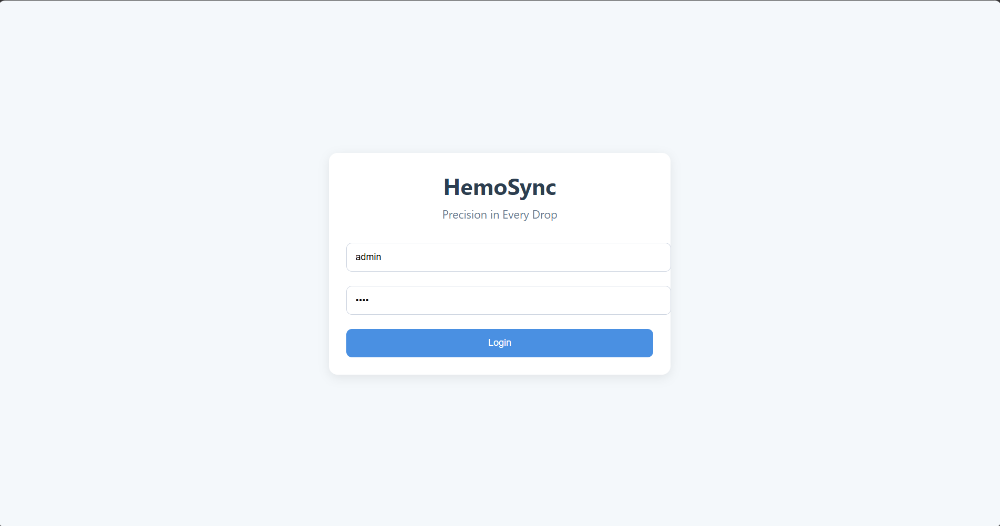
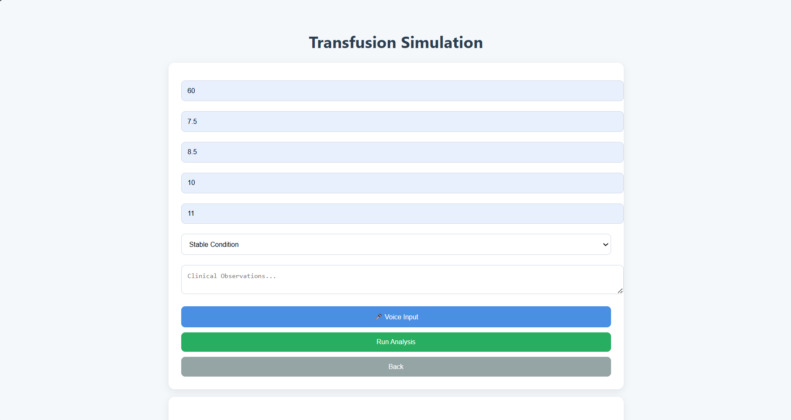
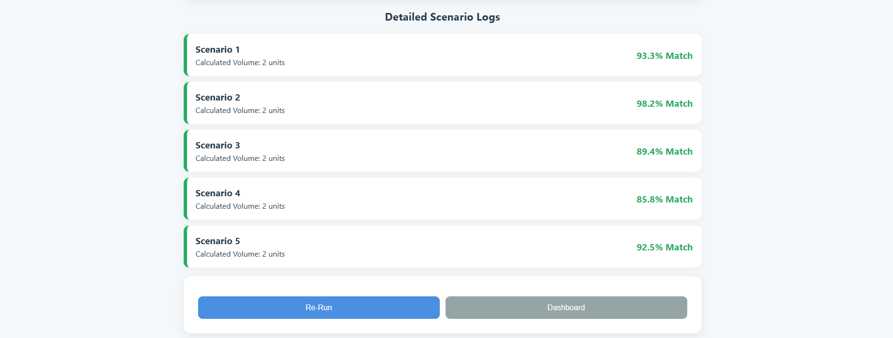
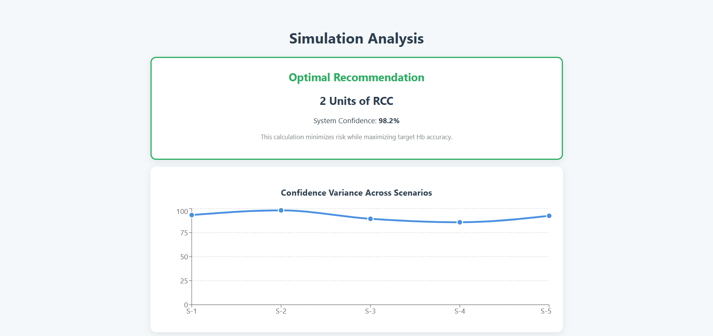
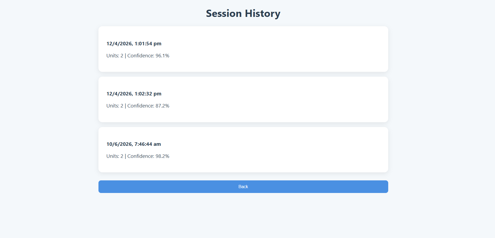

# HemoSync - Blood Transfusion Decision Support System
AI-driven stochastic clinical decision support system for precision RBC transfusion with simulation-based recommendations, safety scoring, and explainable insights.

### Overview
HemoSync is a proof-of-concept healthcare innovation designed to support precision RBC transfusion decisions. The system uses stochastic simulation to generate multiple transfusion scenarios, evaluates safety through confidence-based scoring, and presents recommendations through an interactive dashboard.

### Key Features
- Stochastic transfusion simulation
- Confidence-based safety scoring
- Interactive dashboard and graphs
- AI-powered medical term clarification
- Voice-enabled doctor notes
- Session history tracking
- Real-time clinical decision support

### Technology Stack
- React.js
- React Router DOM
- Recharts
- Local Storage API

### Technology Readiness Level
TRL 3 – Experimental Proof of Concept

### Screenshots

### Login Page

### Patient Details Form

### Dashboard

### Confidence Graph

### AI Chatbot

### History Page

### Future Scope
- Hospital Information System integration
- Reinforcement Learning optimization
- Clinical validation using real-world datasets

### Status
Active Research & Development Prototype

### Demo Video
Available upon request.
